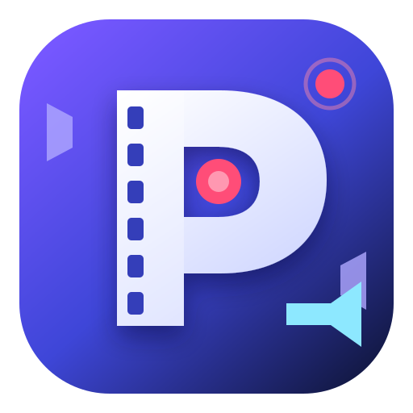

  

# PrimeCap

PrimeCap is a rooted Android screen recorder built from Open Recorder. It keeps
the original app's Compose interface, audio capture, recording controls, and MP4
muxing, while replacing the video source with a privileged capture path derived
from [scrcpy](https://github.com/Genymobile/scrcpy). The result is an on-device
recorder: scrcpy contributes its proven display-capture and MediaCodec pipeline,
but no desktop client or network connection is involved. 

The outcome is in < Android 12, FLAG_SECURE enforcement wasn’t equally airtight across every capture path / compositor route. scrcpy historically used lower-level screen-capture mechanisms rather than the normal MediaProjection API, and on some older Android versions/device builds it could still capture things that the ordinary screenshot/recording path blanked. Later Android releases tightened enforcement deeper in SurfaceFlinger/display composition, so there were fewer holes. The scrcpy maintainer states that secure-flag apps “may only be mirrored with Android < 12,” and specifically says that since Android 12, the system refuses to capture them even with scrcpy’s privileges.

## How the integration works

1. The build extracts the vendored, unmodified scrcpy 3.3.4 archive, applies the
   small patch in `app/scrcpy/primecap-daemon.patch`, and adds the sources under
   `app/scrcpy/overlay`. This produces the packaged `primecap-video-daemon` and
   `primecap-relay` assets; the patch and overlay keep the divergence from
   upstream visible and reviewable.
2. When recording starts, PrimeCap uses root to stage a tiny native launcher.
   The launcher deliberately changes supplementary groups, GID, UID, and SELinux
   context before starting the daemon with the identity of Android's real
   `adb shell`. That shell context is what lets scrcpy's display capture run on
   the device outside the app process.
3. The daemon adapts scrcpy's `ScreenCapture` and `SurfaceEncoder` into a
   single-session service on an abstract local socket. The disposable,
   root-launched relay connects the app to that socket over its own standard
   input/output, so the APK does not expose a network service.
4. PrimeCap sends capture size, bitrate, codec, and frame-rate options, then
   receives a compact framed stream of format metadata, encoded H.264/H.265
   samples, end markers, and errors. MediaCodec timestamps and flags are retained.
5. The Android app owns everything after capture: it aligns the video with
   MediaProjection-backed (or optional root writeback) internal audio and/or microphone audio, implements
   pause/resume and readiness synchronization, muxes the tracks into MP4, and
   publishes the finished recording through MediaStore. The app also owns daemon
   lifecycle and stops only the exact PID acknowledged by its protocol.

The more detailed daemon build and protocol notes live in
[`app/scrcpy/README.md`](app/scrcpy/README.md).

---

## Legacy Open Recorder documentation

The original project documentation and credits are preserved below.

# Open Recorder

An open-source screen recorder for Android with internal audio and a modern interface. No ads, no trackers and no internet access.

## Features

### Recording

- Record your screen to MP4 files saved in `Movies/Open Recorder`
- **Audio sources:** no audio, internal audio, microphone, or microphone and internal audio mixed together
- **Audio sample rate:** 44.1 kHz or 48 kHz
- **Video codec:** H.264 or H.265
- **Resolution:** native, 1080p, 720p, or 480p
- **Frame rate:** automatic, 120, 90, 60, or 30 fps
- **Video bitrate:** automatic, 4, 8, 16, or 24 Mbps
- **Orientation:** automatic, portrait, or landscape
- **Force 16:9 with letterboxing:** fits the full capture inside a 16:9 frame without cropping
- **Recording countdown:** off, 3, 5, or 10 seconds, so you can open the screen you want to capture. You can cancel while it counts down
- **File naming pattern:** `dd-mm-yyyy`, `mm-dd-yyyy`, `yyyy-mm-dd`, or `yyyy-dd-mm`, followed by `_hh-mm-ss`

### Controls

- Start and stop from the app's main screen
- **Notification controls:** pause, resume, and stop while recording
- **Quick Settings tile:** tap to start, and tap again to stop. It also shows the current state (starting, recording, paused, saving, stopping)
- Recording keeps running if you close the app
- After saving, a notification lets you **watch**, **share**, or **delete** the video

### Recordings tab

- Lists the videos recorded by Open Recorder, with total count
- Sort by date, size, or duration
- Open a video in your default player
- Select one, several, or all recordings and delete them (Android asks you to confirm)

### Appearance and settings

- Light, dark, or follow-system themes
- Dynamic color (Monet) variants of each theme
- Optional predictive back gesture (off by default)
- Settings are saved between sessions

### About

- Project page with a link to the source code and the GPL-3.0 license
- Built-in list of open-source licenses used by the app

## Privacy

- **No internet permission.** The app cannot connect to the network
- No ads, no analytics, no crash reporting, no tracking
- Backups are disabled
- Recordings stay on your device
- Other apps are not allowed to capture Open Recorder's audio

## Permissions

| Permission | Why |
|---|---|
| `RECORD_AUDIO` | Microphone and ordinary internal audio capture; not root playback alone |
| `POST_NOTIFICATIONS` | Recording controls and "saved" notification |
| `FOREGROUND_SERVICE` | Keeps recording while the app is in the background |
| `FOREGROUND_SERVICE_MEDIA_PROJECTION` | Required by Android for screen capture services |
| `FOREGROUND_SERVICE_MICROPHONE` | Required by Android for microphone capture services |

## Requirements

Android 10 (API 29) or later.

## Limitations

These come from Android itself, not from this app:

- Android asks for your confirmation every time you start a recording.
- Apps that block capture (DRM video, banking apps, anything using `FLAG_SECURE`) can appear black or silent.
- Ordinary internal audio only includes apps that allow playback capture.
- Optional **Use root audio capture** uses the named MediaTek `DL1_AWB_Record` playback writeback endpoint. It requires a supported kernel and root access; no Android playback-capture fallback is used. See [backend design, validation, and limitations](docs/root-audio.md).

## Credits

- Capture engine inspired by the Android Open Source Project (AOSP) SystemUI screen recorder
- UI built with [Miuix](https://github.com/compose-miuix-ui/miuix) for Compose
- Dynamic colors powered by [MaterialKolor](https://github.com/jordond/materialkolor)
- Navigation and UI are adapted from [AsteriskNG](https://github.com/Asterisk4Magisk/AsteriskNG) (Copyright 2026, AsteriskNG contributors), licensed under GPL-3.0.
See [NOTICE] (NOTICE) for full third-party attributions.

## License

[GPL-3.0-only](LICENSE)
